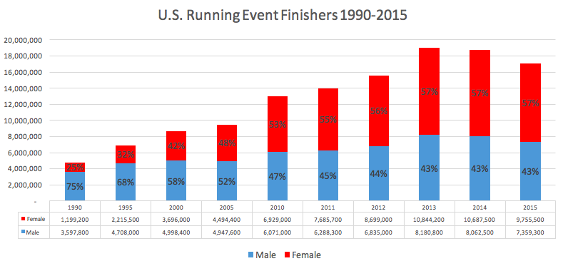
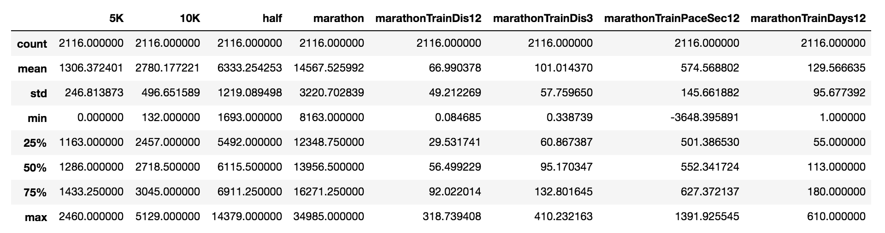
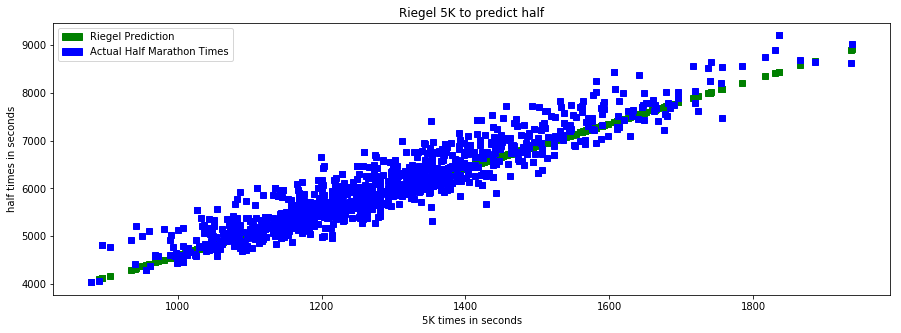
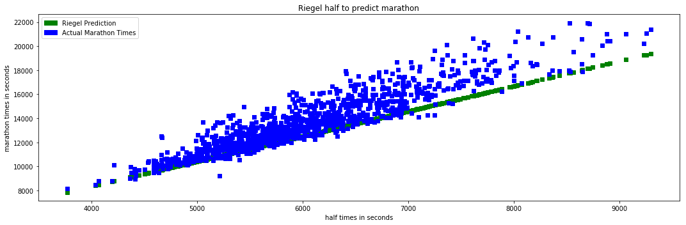

# Machine Learning Engineer Nanodegree
## Capstone Project - Machine Learning Race Predictor
Dimitri Bilenkin 
February 24th, 2018

## I. Definition

### Project Overview

Running has been experiencing a huge surge over the last few decades. The number of participants from local 5ks to marathons to ultra marathons have continued to increase. According to the Running USA marathon report<sup>1</sup>, Marathon finishers have gone up above 500K in recent years from just over 350K in 2000 and only 25K in 1976. As a result, there are many beginner runners attempting longer distances.



When new runners first attempt to train for a marathon, it's important for them to understand what kind of training they need. Come race day, it's crucial that they know what pace they should maintain in order to finish with their best time. Unfortunately, many beginners fail to adequetely train and start their marathon at too fast of a pace. When searching for a training plan, the web is full of beginner plans that are too low on mileage. Even worse, there are a number of race pace calculators based on outdated formulas originally created based on elite runner data that can be quite inaccurate for new runners.

As a new runner at the 2009 Philadelphia Marathon, I made both of these training and pace mistakes and finished with a 10 minute positive split. That means the second half of my race, and especially the last 6 miles, were way slower than the first. My expectations of my performance were way off because I had used an online calculator that predicted an unrealistic marathon time.

### Problem Statement

In 1977, American research engineer Peter Riegel proposed a simple formula to compare "equivalent" efforts in different distances<sup>2</sup>:
```
T2=T1*(D2/D1)^1.06
```
This was published in Runner's World and the majority of race pace calculators found online are based on some variation of this old formula. If you just google "Race Predictor", the first several sites that show up all use it. The problem with this formula is it's based on data from elite athletes who know how to properly train for different distances. It doesn't take into account any other factors about the athlete, most importantly, their training volume.

I plan to use real data from the general population of runners that includes features such as training volume and pace along with other race PRs. There will be a data preprocessing step where I will remove outliers and other bad data. After that, the data will be split into the training and testing sets. Then I will try out several machine learning algorithms for regression and determine which has the best results using the evaluation metric mentioned later. There may be some fine tuning once a model is chosen to see if tweaking some of the hyper parameters could yield even better results. 

### Metrics

Because the marathon time predictor is simply trying to predict the time of a target race such as a marathon or half marathon this is a regression problem. I plan to use the coefficient of determination (R^2) and compare the result of the benchmark (Riegel's Formula) versus the algorithm. And, also use it to for feature selection as well as evaluating algorithms.

R^2 is the proportion of the variance in the dependent variable that is predictable from the independent variable(s).<sup>3</sup>. As you can see in the formula below it is calculated by subtracting the sum of squares of residuals (error, or measure of how far off the predicted is from the true values) divided by the total sum of squares which is the variance of the data set from 1. It can range from 0 to 1, where 1 would be perfect predictions with no errors.


But, I also want to use something simpler in this case, mean percent off: the percentage the predicted race time is off from the actual result. Because I am looking at how far off it is, I will be taking the absolute value of the difference so there won't be a scenario where the bad guesses average out. Meaning in a prediction of +5% too high and -7% too low, this will average to 6% and not -1%.

Looking at both R^2 and Mean Percent Off will give a good indication of how well the algorithm is able to predict based on the features.

## II. Analysis

### Data Exploration

Gathering good data was the most challenging and time consuming part of this project. I knew I wanted running data that consisted of not only race results, but also daily running activity data as well. **Note that going forward I will refer to data having to do with training for a race as activity data rather than calling it training data and confusing it with training data sets for machine learning.**

I looked at various running log websites where users had the option to publish their results publicly. After looking at runkeeper, strava, runningahead and mapmyrun, I decided the Garmin Connect site (https://connect.garmin.com) had what I was looking for.

I wrote a script to collect data by traversing connections of users who share their logs publicly. The script ran over the course of several days and visited over 50K users. Of those, only about 10K had public logs that contained race data for a 5K and a half marathon (my initial minimum threshold).  Of those users, another script retrieved activity data for the previous 12 months before each (personal record) PR found for common race distances (5K, 10K, half marathon, marathon). This reduced the dataset further to 4688 rows.

After finding a PR in a user's activity I generated the following features for each of the 4 common race distances:

```
Race Date
Previous 12 months average mothly distance (monthly just so the numbers made sense to me as a runner)
Previous 12 months average pace
Previous 12 months activity count
Previous 3 months average monthly distance
Previous 3 months average pace
Previous 3 months activity count
```

At this point, I wasn't sure which features would end up having the biggest influence, so I grabbed more than what I thought the model what ultimately use.

Another big challenge was pulling the meaningful data from all of the data gathered. Because I really wanted to use activity data as part of the feature set, this excluded a lot of the data where the records for the marathon and half marathon were at a date where there was no activity. For example my marathon record may be from 2010 but I don't have my activity data in garmin going back that far. I was actually not part of the training data set.

At this point the data was ready to be imported into the Jupyter notebook. I knew there would be further data preprocessing to deal with outliers and other noise in the dataset. I'll discuss the details of that in the data preprocessing section.

The first thing we need to look at once the data is imported is what the ranges of each of the features look like and see if there are any abnormalities. After removing records with empty rows and converting all the times to seconds so we are dealing with numbers I printed the `describe` function of the DataFrame.



After removing empty rows with data that is either empty or set to 0 we are already down to about half of the rows at 2116. Going through each of the features, it's clear that there is a lot of data that will need to be cleaned up. For example, all the minimum's in every feature are all not realistic data. Every race result has a time that is below a world record. Also for average activity data there are minimums averaging less than 1 mile a month which probably means those running logs did not keep much of there actual running data there and should not be used when training the models. 

But aside from the outliers, the means for each of the features generally align with my expectations. Average 5K time of 21:46 seems a bit low, but makes sense with some of the very low outliers. I imagine this will go up when they are removed. Average monthly miles of previous 3 months and 12 months before a marathon are 101 and 67 respectively which definitely seems right. Other than some bad data, most of it looks good and ready to move to the preprocessing step.

### Exploratory Visualization

After importing the data and doing some initial cleanup of removing rows with not enough data for running activities and PRs, I wanted to see what the relationships were between all of the features and if it was what I expected.


This was basically what I expected. There was a closer relationship between races that were closer in distance. Also, as I expected there was an inverse relationship between activity distance and race results. But for all these graphs, they weren't very clear, because there were some serious outliers in some of the features. Specifically in the pace feature there was at least one feature that had a ridiculously large negative pace that was throwing everything off. 

After removing some nonsense data and outliers which I will discuss later, the relationships were a lot more clear:


It was important to visualize the problem with the Riegel formula. When using it to predict a half marathon from a 5K time, it actually doesn't do to bad a job. It almost looks like a simple linear regression. But it's clear there is enough variability in the half times that something else isn't being accounted for.



Once we move to predicting a marathon, it's clear that the line is way off, and here is where the real problem is. The majority of the predictions are below the actual results. Around 90% for using both the 5K or half marathon.




### Algorithms and Techniques

Predicting half marathon and marathon times using existing labeled data is clearly a supervised regression problem. I considered several algorithms to solve this problem. Because there are relatively few features, and some of them appear to have linear relationships, I knew it made sense to start with linear regression. 

Even though I didn't have too many features I still wanted to try a couple regression algorithms that include regularization. Lasso and Ridge are two regression algorithms that introduce the concept of regularization. This means they penalize the magnitude of coefficients in an effort to minimize overfitting. 

Lasso does this by adding a penalty equivalent to the absolute value of the magnitude of the coefficient, while Ridge adds the penalty of equivalent to the square of the magnitude of coefficients.<sup>4</sup>

I also wanted to try Gradient Boosting as I've had good results with it before. Gradient Boosting is an ensemble algorithm that combines a lot of weak learners (simple decision trees) one at a time and evaluating the result using a loss function. I thought it might be appropriate here because ensemble methods have proven to get superior results in many situations when the features have a more complicated relationship than can be determined by a simple linear regression. I didn't expect it to do better than Linear Regression if I was just using race PRs, but since I was also including activity data, I wanted to see if it could give a better result.

Finally, I threw in K Nearest Neighbors, mostly because it works so differently from the algorithms. It basically just finds the closest neighbors by distance in the data space and returns the average of the label. Again, I wasn't expecting this to be the best, but wasn't sure how it would do, because I didn't know exactly what the data space looked like.

I looped over all of these regressors with their default hyper parameters and I also did this on every subset of combination of features. I wanted to try all the combinations for two reasons. First, I wanted to see which combinations of features were best at predicting results. If it turned out that certain activity data didn't help, there was no need to use it. I didn't want more features than needed. Second, I wanted to be able to give a prediction based on what data a user had available. I wanted to have different trained regressors that would do better depending on what features were used as an input. 

For example if a user only had a 5K time but no half time to predict a marathon, I still wanted to have a prediction. After looping through all the regressors, gradient boosting worked best for predicting both half marathon and marathon times. But, I should say the differences between the regressors was quite minimal.

### Benchmark

As mentioned in the problem statement and elsewhere, the clear benchmark that I was trying to improve upon was Riegel's formula. I was able to run the formula to generate predicted half marathon and marathon race times based on shorter races and used these predictions in the chosen evaluation metrics(R^2 and mean percent off) to see how my trained models compared.

When using R^2 as well as average percent off to evaluate the current benchmark of Riegel's formula I get the following results:

Riegel for half based on 5K:
Average percent off 3.90%
Coefficient of Determination (R2):  0.859521934604

Riegel for marathon based on 5K:
Average percent off 10.09%
Coefficient of Determination (R2):  0.356883579775

Riegel for marathon based on half:
Average percent off 7.75%
Coefficient of Determination (R2):  0.609482078262

From this it's clear that using Riegel for predicting a half marathon from a 5K is already not bad. For the marathon, though, there is lots of room for improvement.

## III. Methodology

### Data Preprocessing

As was made clear in the visualization section, when I first compared all the features with each other, it was clear there was both a lot of noise and a lot of outliers. I dealt with these in two separate passes to clean up the data.

First, I removed what I called 'nonsense' data. I removed all the race times that were faster than world records. Then I removed records that had **very** low activity volume. My thoughts here were that if someone was training for a marathon and is running less than 40 miles a month, it's more likely that not all of their activity data is being recorded rather than they actually ran that little. I knew this would be a problem going in, so I thought removing these very low numbers would help.

Even after doing this, it was clear there were still some outliers that were creating noise. Some of the PRs could be way off from each other because it's not clear that these were best efforts. For example, let's say I ran a 5K with my slower friend and then went on to run a PR marathon. My real 5K PR may not even be in the data. In that case my slow 5K pr will be completely out of whack with the marathon time. I wanted to exclude the most significant cases of this.

After trying a couple different outlier methods like Isolation Forrest, Elliptic Envelope, and my own naive method of removing individual outliers, Elliptic Envelope gave the best results. I set the contamination to 20% because I knew there was a lot of "bad data" so I thought getting rid of a good chunk of it would help with predictions. I tried different percentages, and this seemed like a good balance without removing too much data that was representative of real variation.

### Implementation

I used python 2.7 in a Jupyter notebook for all of the work once I had all the data. I used the scikit-learn library for all of the data splitting, all of the algorithms and for the R^2 evaluation metric.

numpy was imported for dealing with NaN values, and of course I made use of pandas DataFrames throughout the entire project, as well as pyplot for visualizations.

Because I was dealing with race times I used both datetime and time modules to convert and compare times.

I created a separate DataFrame for half marathon and marathon data that each had their own features specific to them. From here on forward I will describe what was done with one of these datasets, as for each step I generally looped over the two datasets.

Using `train_test_split` I generated the `X_train, y_train, X_test, y_test` data sets to run through my chosen regression algorithms.

As mentioned in the Algorithms and Techniques section, I wanted to try several algorithms that I thought could work well given a supervised regression problem with less than a dozen features. I looped over all the algorithms and used the coefficient of determination (R^2) to evaluate which regressor was best. 

I also wanted to try every subset of combination of features to see which features gave the best results and to create a model that could predict off of any inputs. I imported `combinations` from `itertools` to handle this.

I created a `print_results` function that creates a single DataFrame combining the predicted results with the real results including a column showing the percentage the result was off from the real result. In this function I also calculated the R^2 which was used to determine which model was best. I added a verbose parameter to print even more information including the head of that DataFrame to easily compare how different regressor and feature combinations performed. This was very valuable when comparing results.

Next, I created a `run_regressor` function to run a regressor with every subset of combination of features from just one feature to all of them. This function also kept track of the best regressor for a given feature combination to be used later.

Finally, I created a `run_lots_o_regressors` function where I looped through the list of regressors I wanted to try and called the `run_regressor` function and kept track of the best overall regressor for predicting a half marathon and marathon.

Running the `run_lots_o_regressors` function printed out the results of each regressor with the best feature set combination. Here is an example of a couple of them along with the best regressor at the end:

```
---- Lasso(alpha=1.0, copy_X=True, fit_intercept=True, max_iter=1000,
   normalize=False, positive=False, precompute=False, random_state=None,
   selection='cyclic', tol=0.0001, warm_start=False) ----
best feature combo:  10K|half|marathonTrainDis12|marathonTrainDis3|marathonTrainPaceSec12|marathonTrainDays12
R2: 0.857
percent off: 4.94%

---- KNeighborsRegressor(algorithm='auto', leaf_size=30, metric='minkowski',
          metric_params=None, n_jobs=1, n_neighbors=5, p=2,
          weights='uniform') ----
best feature combo:  10K|half|marathonTrainDis3|marathonTrainPaceSec12
R2: 0.847
percent off: 5.21%

best overall -----
best feature combo:  10K|half|marathonTrainDis3
best reg:  GradientBoostingRegressor(alpha=0.9, criterion='friedman_mse', init=None,
             learning_rate=0.1, loss='ls', max_depth=3, max_features=None,
             max_leaf_nodes=None, min_impurity_decrease=0.0,
             min_impurity_split=None, min_samples_leaf=1,
             min_samples_split=2, min_weight_fraction_leaf=0.0,
             n_estimators=100, presort='auto', random_state=None,
             subsample=1.0, verbose=0, warm_start=False)
best percent off:  4.66326850913
best r2:  0.866885237273
```

Before trying every combination of features, I initially ran regressors using all of them, until it ocurred to me that I should try subsets of features to see if they do better. I also initially didn't get great results because I forgot that I should remove outliers. Then, when I did remove outliers, I removed them by feature, independently of each other. This meant I may be removing those people who ran a very fast or very slow marathon. This is not what I wanted. I didn't want to remove those results. I wanted to remove results where there was a very fast marathon with a very slow 5K. Using Elliptic Envelope helped with this.

There was a lot of troubleshooting and figuring out what best way to gather all of the data. I am still a novice at python, so lots of these steps took a long time. It took me a  just to understand the differences between DataFrames and Series and just python lists.

After I worked through all of my problems, and got my data in as clean a state as I could, for both the half marathon and marathon model the winning algorithm was Gradient Boosting.

### Refinement

Once it was determined that Gradient Boosting was the best algorithm of the ones I evaluated, I wanted to see if I could tune some of the parameters. There are many to choose from, but from previous experience I wanted to focus on changing the following three: n_estimators, max_depth, learning_rate.

I used `grid_search` to try every combination of 3 values of each of these out to see if they could be improved from the default. The default for each of these parameters respectively is: 100, 3, .1

I decided I would try a bit less and a bit more for all of these to see if they would improve. Here is what I set my parameters to: 

```
parameters = {'n_estimators': [50, 100, 500],'max_depth':[1,3,5], 'learning_rate':[0.05,0.1,0.2]}
```

After running grid search using R^2 as the scoring function, I got the following results:

```
Unoptimized model
------
R^2 score on testing data: 0.8681

Optimized Model
------
Final R^2 score on the testing data: 0.8608
```

Frankly, I was surprised none of them yielded better results than the default model. I thought it might be close, but slightly larger and I could explore further. But after seeing this it was clear my biggest problem was with the data to begin with, not with tweaking parameters in an algorithm.

## IV. Results

### Model Evaluation and Validation

After looping through all the different regressors with every subset of feature combinations, the two best models for predicting half marathon and marathon times emerged.

Here is the best model for predicting marathon times:

```
best overall -----
best feature combo:  10K|half|marathonTrainDis3|marathonTrainPaceSec12
best reg:  GradientBoostingRegressor(alpha=0.9, criterion='friedman_mse', init=None,
             learning_rate=0.1, loss='ls', max_depth=3, max_features=None,
             max_leaf_nodes=None, min_impurity_decrease=0.0,
             min_impurity_split=None, min_samples_leaf=1,
             min_samples_split=2, min_weight_fraction_leaf=0.0,
             n_estimators=100, presort='auto', random_state=None,
             subsample=1.0, verbose=0, warm_start=False)
best percent off:  4.68609132728
best r2:  0.874918871306
```

Here is the best model for predicting half marathon times:

```
best overall -----
best feature combo:  5K|10K|halfTrainDis12|halfTrainDis3|halfTrainPaceSec12|halfTrainDays12
best reg:  GradientBoostingRegressor(alpha=0.9, criterion='friedman_mse', init=None,
             learning_rate=0.1, loss='ls', max_depth=3, max_features=None,
             max_leaf_nodes=None, min_impurity_decrease=0.0,
             min_impurity_split=None, min_samples_leaf=1,
             min_samples_split=2, min_weight_fraction_leaf=0.0,
             n_estimators=100, presort='auto', random_state=None,
             subsample=1.0, verbose=0, warm_start=False)
best percent off:  2.86401830701
best r2:  0.930477771748
```

In both models, Gradient Boosting had the best results, although by the slimmest of margins and not consistently. Depending on what data I used when I was refining the percent of outliers or incorporating more data that my script retrieved, the numbers would slightly change and occasionally linear regression was best and once, also Lasso.

For example here is the runner up regressor for predicting marathons:

```
---- LinearRegression(copy_X=True, fit_intercept=True, n_jobs=1, normalize=False) ----
best feature combo:  10K|half|marathonTrainDis12|marathonTrainDis3|marathonTrainPaceSec12|marathonTrainDays12
R2: 0.862
percent off: 4.96%
```

The R^2 is off by .012 and the percent off is only slightly worse. Also, interestingly, the combinations of features used would change as well. This is because some of the features were closely correlated with each other. The best models would use some combination of distance PRs, activity volume and pace. For example, in this last iteration, the best marathon regressor used 10K pr, half pr, last 3 months of activity distance and last 12 months of activity pace. In previous iterations, it might only use the half PR, or it would also use the last 12 months of activities in addition to the 3 month activity distance. But it would never not have any activity distance or not have a race pr.

After running through to train, predict and evaluate regressors dozens of time with different amounts of data that kept getting split randomly each time, I got very consistent results. This makes me feel very confident that the models that were created can be trusted to perform well with new data.

### Justification

#### Half Marathon Model

First I compared the Riegel formula to just using 5K PR alone in the best regressor found:


I wanted to see if just using 5K alone would improve the result over Riegel. In this case, there isn't much of an improvement. The R^2 goes up slightly, but the percentage off increases slightly. Again, for predicting half marathon times using Riegel with just 5K is not that bad.

But let's see what happens when we include training data:


Now we see a clear improvement. The R^2 went up from .84 to .93 and the percent off went from 4.14% to 2.86%. Those are both significant.

Let's look at a couple rows as an example in each chart. In the bottom row, of the first chart, the prediction is 14% off which is pretty bad. Let's see what happened. The 5K time of just over 20 minutes predicted a half marathon of 1:32, but the actual result was 1:47. Well if we look at the training distances, they are quite low. Averaging less than 50 miles a month for the last three months before a marathon is really low. In the second chart where we still don't use anything other than the 5K time, the prediction is slightly improved but is still over 12% off. This is no surprise, and the only reason it improve at all, is because in general the predictions for marathon times from 5Ks were all too low using the Riegel formula. Now, in the last chart, the percentage has gone all the way down to only 7% off. Finally the low training distance has been factored in.

Now let's look at the opposite example of the predicted time being to high. In the 4th row of the first chart, the predicted time is 5% too high. It is no surprise that it gets even worse up to 7% in the second chart as all of the times are estimated higher there. But, in the third chart when the high training volume is factored in, the prediction is only 1% off!

#### Marathon Model

Predictions for the marathon were even more pronounced. Using Riegel's formula, based on 5K PRs the formula's predictions are over 10% off and have an R^2 of .35. Using the half marathon is an improvement but still results in R^2 score of only .61. This is no surprise, as we saw earlier how 90% of the predictions were too low.


When using the best model and the best feature combo, we end up with an R^2 of .87 and less than 5% off on average. This is a huge improvement. 


Now if only I could go back in time to 2009 and plug in my data before I ran my first marathon and see what would have happened. Let's hop in my time machine and go back now...

*I'm excited to run my very first marathon. I've recently run a 5K with a time of 23:03 and a half marathon in 1:48:36. Using one of these handy calculators predicts a marathon time of 3:41:04 and 3:46:25 respectively. Now, I should probably go with the more "conservative" prediction based on the half. That means I need to maintain a 8:38 pace.*

*WAIT! What's this?! A machine learning race predictor??? Maybe I should use that instead. Interesting, here I can input my 12 month average training distance and training pace. Ok, I guess I didn't run that much over this past year especially in the beginning. I only averaged about 70 miles a month, and I kept an average pace of 8:40 during my training. Oh wow, this gives me a predicted time of 4:03:55. Wow, that means I should actually plan on maintaining a 9:18 pace.*

*Come race day, I get a bit excited and run at a 9 minute pace for the first half, but surprisingly in the second half I don't fade at the end, and instead of having a miserable finish, I'm able to finish strong and actually speed up! I end up with a 3:50, but more importantly, I feel like I ran a balance race!*

Ok, back to the present. What really happened is I started way too fast and faded pretty badly and ended up with a 3:54:34. Who knows what would have really happened, and I'm just one data point, and the truth is, in this case, the race predictor didn't do a better job other than error too high instead of too low.

If I use it to figure out how I would have done the following year when I got my PR, it does a much better job than the calculators:

```
2010 - pr marathon:
online calculator using 5K:  3:19:58
online calculator using half:  3:29:44
ML Race Predictor:  3:45:45
What I actually ran: 3:37:07
```

## V. Conclusion

### Free-Form Visualization

Here's a visualization of the same graph as before showing 5K times vs. marathon times, but this time using the best marathon model:


The first thing that should be obvious, is that the predictions are not in a straight line. This is because the model is using many features to make a prediction. It may be hard to tell, but in some spots you can see where the prediction is moving up and down with it's corresponding real value.

### Reflection

I had the idea for this capstone very early on when I first started this nanodegree. I wasn't sure whether it would be possible to pull off, mostly because I knew getting the data would be a challenge. I was definitely right about that. Getting good data was the hardest part, and it remains the biggest weakness and source of improvement. I'll address that in more detail in the next section. 

I spent a lot of time just evaluating where I could get data from, and then when I did settle on the Garmin site, I had little experience with going through web pages programmatically and fetching data. It took a lot of trial and error until I finally had the script running and collecting data. And even then, it would frequently stop when it would encounter an unusual situation. I needed it to recover when it encountered an error and start over but without losing data or going to the same user logs. 

Even after I gathered a lot of data, it was clear that I would need to throw the majority of it out because it didn't have the data points I wanted, or it was clearly incomplete and thus lead to bad predictions. It's clear some of that is still going on in the model.

I was so pleased when I first started to see success in the models and they first beat the benchmark. That's when I realized that even though I didn't have great data, it was still possible to make a big improvement on the existing formula. I realize that it's possible that I just set a low bar for myself to beat, but given my trouble with gathering data and the effort I put into cleaning the data and trying out different models and feature selection, I'm not sure how much better I could do.

I admit, I was a bit disappointed that my personal story with my first marathon didn't quite work out, as my own model predicted a time 9 minutes too slow instead of 8 minutes too fast, but that's not really the point of all this. It's clear that overall, this model does a better job, and I am just one data point. Besides, it did a much better job for my following year marathon PR. There it was too slow by 8 minutes, but Riegel's formula was too fast by 16! If nothing else it just made me feel that I was faster at longer distances compared to the rest of the population :)

Overall, I'm pleased with the results and feel that being able to predict marathon times within < 5% is pretty darn good. I intend on continuing to my bonus idea where I export the model (using pickle) and use it in an API (using AWS lambda) for a web application. I'm hoping that by the time I get feedback on this report, I'll be well on my way to finishing the bonus portion.

### Improvement

As I've already mentioned several times before, I think it would greatly help to get more, better data. By the time I cleaned up the data, there were only about 1000 records for each model. To have enough coverage of the wide range of finishing times and different training regimens, I think it would be helpful to see what 10 times or 100 times more data would yield. 

But, then if I did have more data, I would also want to add further constraints. for example, one thing I tried was to restrict the previous PR races to only dates that were close in time to the predicted race. I did not have good luck with this, perhaps because it reduced the data even further so the model ended up performing worse than before. 

Other than getting more data, I could have tried some more feature engineering, but I don't think there was something I could have done more when it comes to choosing a better algorithm or tuning it more. Because there were such similar results from many algorithms, it seemed the problem wasn't in the algorithm selection.

If I was able to get more data, I'd also be interested in getting data on the races themselves. If I could get data on the course, the weather the day of the race, this could also be used as part of the prediction. 

Given more time, I would collect more data, perhaps from different sources, and this would drive other approaches and likely the use of other techniques and algorithms.

If you've gotten to the end of all this, thank you so much for taking the time to read it! I've really enjoyed this course and especially this last capstone project!

### References

1. Running USA, June 15, 2017, http://www.runningusa.org/marathon-report-2017

2. Riegel, Peter S. (May–June 1981). "Athletic Records and Human Endurance". American Scientist. 69: 285–290.

3. Coefficient of Determination definition, http://stattrek.com/statistics/dictionary.aspx?definition=coefficient_of_determination

4. A Complete Tutorial on Ridge and Lasso Regression in Python,https://www.analyticsvidhya.com/blog/2016/01/complete-tutorial-ridge-lasso-regression-python/

-----------

