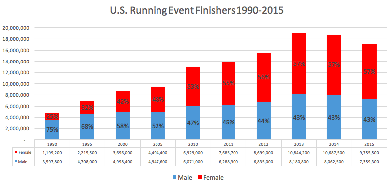

# Machine Learning Engineer Nanodegree
## Capstone Proposal - ML Marathon Predictor
Dimitri Bilenkin - February 15th, 2018

## Proposal

### Domain Background

Running has been experiencing a huge surge over the last few decades. The number of participants from local 5ks to marathons to ultra marathons have continued to increase. According to the Running USA marathon report<sup>1</sup>, Marathon finishers have gone up above 500K in recent years from just over 350K in 2000 and only 25K in 1976. As a result, there are many beginner runners attempting longer distances.



When new runners first attempt to train for a marathon, it's important for them to understand what kind of training they need. Come race day, it's crucial that they know what pace they should maintain in order to finish with their best time. Unfortunately, many beginners fail to adequetely train and start their marathon at too fast of a pace. When searching for a training plan, the web is full of beginner plans that are too low on mileage. Even worse, there are a number of race pace calculators based on outdated formulas originally created based on elite runner data that can be quite inaccurate for new runners.

As a new runner at the 2009 Philadelphia Marathon, I made both of these training and pace mistakes and finished with a 10 minute positive split. That means the second half of my race, and especially the last 6 miles, were way slower than the first. My expectations of my performance were way off because I had used an online calculator that predicted an unrealistic marathon time.

### Problem Statement

In 1977, American research engineer Peter Riegel proposed a simple formula to compare "equivalent" efforts in different distances<sup>2</sup>:
```
T2=T1*(D2/D1)^1.06
```
This was published in Runner's World and the majority of race pace calculators found online are based on some variation of this old formula. If you just google "Race Predictor". The first several sites that show up all use it. The problem with this formula is it's based on data from elite athletes who know how to properly train for different distances. It doesn't take into account any other factors about the athlete, most importantly, their training volume.

### Datasets and Inputs

I will admit that gathering good data for this project is one of the biggest challenges. I considered several sources of public race data but ultimately decided that I needed to get training data as well. I looked at various running log websites where users had the option to publish their results publicly and I settled on the Garmin Connect site (https://connect.garmin.com)

I wrote a script to collect data from the 10% to 15% of users who share their logs publicly and retrieved training data as well as PRs (Personal Records) in common distances (5K, 10K, half marathon, marathon). I'm still in the process of gathering this data and I know one of the challenges will be to remove the outliers and noise. For example if someone has a 5K PR 3 years prior to their Marathon PR, that may not be a useful data point, as they could have been in very different fitness levels.

### Solution Statement

I intend to use the collected training and race data, as well as other user information such as age and gender to perform supervised learning with the goal of predicting half marathon and marathon times. I will first need to prepare the data and understand which features are most predictive as well as remove outliers.

I will then create a train/test split of the data and try several supervised learning models. After which I will tune whichever model is getting the best results to improve it further. 

### Benchmark Model

Naturally, as mentioned prior, the first benchmark I would need to improve upon is the formula that is used by most race pace calculators. I can run that formula on the test data and compare the accuracy to the results of my trained algorithm. After that I plan to search for other race predictors that have improved upon this formula. Of note, the website fivethirtyeight.com which is famous for it's predictions of elections has taken a crack at it. My ultimate goal would be to beat their race predictor: https://projects.fivethirtyeight.com/marathon-calculator/

### Evaluation Metrics

Because the marathon time predictor is simply trying to predict the time of a target race such as a marathon or half marathon this is a regression problem. I could use the Root Mean Squared Error and compare the result of the benchmarks versus the algorithm. But, I was considering something even simpler. For example, the percentage that the time is off from the target goal. Because we are looking at how far off it is, we wil be taking the absolute value of the difference so there won't be a scenario where the bad guesses average out. Meaning in a prediction of +5% too high and -7% too low, this will average to 6% and not -1%.

### Project Design

I plan to use a Jupyter Notebook along with sklearn libraries as I am the most familiar with this after exposure to it during the course. After initially gathering data from around 1000 users as a starting point, Using visualizations I will try to understand which features have a strong relationship with the labels (marathon race times). This will be the feature set exploration step.

Then it's time to prepare the data. This may include transforming skewed features, or removing outliers that may have been generated by noise in the data. It may also be necessary to use one hot encoding for categorical data such as gender. I expect there to be a lot of noise because it's not always clear whether a race result is really a best effort. Also, this only shows results for runners who were wearing their Garmin watch during the event. It will be very important to get the data in a cleaner state.

Depending on how many features I end up choosing, I may realize that I need more data due to the curse of dimensionality. If that is the case, I will get more data using the same methods as before. Once I have selected the best features and removed outliers and normalized the data, I will shuffle and split the data between training and testing sets.

Then it will be time to start evaluating different supervised models. Using a training and predicting pipeline I plan to try KNN, SVM and a couple different ensemble methods such as bagging and gradient boosting to determine which model performs best.

Once I get an idea of which of these models seems to be most effective, I will choose a single model to start model tuning. I'll use Grid Search to tune several hyper-parameters depending on which model was chosen. 

Finally I'll evaluate the results using either Root Mean Squared Error or simply averaging the percentage away from the result and compare it to the benchmarks mentioned earlier

### Bonus Web App
If all goes well, and I'm getting good results, I plan to make a web application that allows a runner to input features and see what their predicted half marathon or marathon time and pace should be.


### References

1. Running USA, June 15, 2017, http://www.runningusa.org/marathon-report-2017

2. Riegel, Peter S. (May–June 1981). "Athletic Records and Human Endurance". American Scientist. 69: 285–290.

-----------
